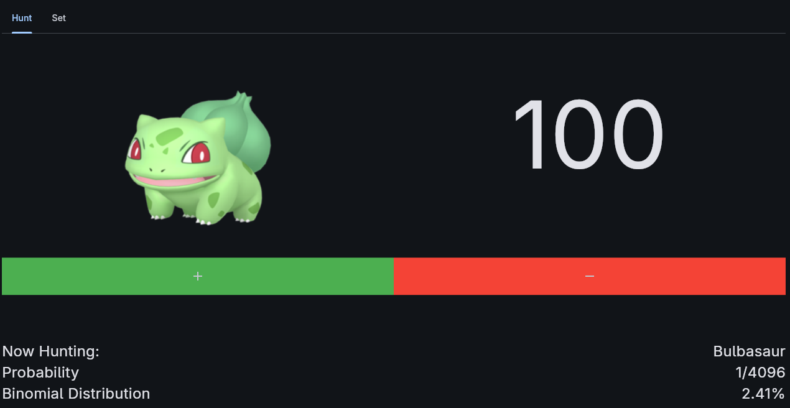

# ShinyHuntTracker

Inspired by https://shinytrack.night.coffee/, ShinyHuntTracker is a way to track your Pokemon shiny hunt history and easily keep count of which Pokemon you're currently hunting. Built with the Python package Flet, you can run this counter universally across all devices.

## Usage



You can select which Pokemon you hope to hunt within the set tab. Set the probability of the shiny by double clicking the value to your liking, then click the + or - buttons to increment/decrement the value. As you keep track, the program lets you know your luck at the bottom, using binomial distribution, showing you the chance of getting at least one or more shiny ($P(x \ge 1)$). You can easily increment the counter by pressing the space bar, making it far easier to increment than just aiming your mouse and clicking the + button every time.

## Installation
Install dependancies Python and Flet.
```bash
pip install flet
```
Clone this repository.
```bash
git clone https://github.com/jfjr-dev/ShinyHuntTracker.git
```
Change into the repository's directory.
```bash
cd ShinyHuntTracker
```
Run the main.py program located in src/main.py.
```bash
python src/main.py
```